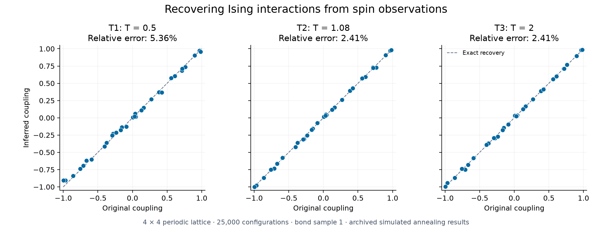

# Machine Learning Approach to the Inverse Ising Problem

**BSc Physics final project · Universitat de Barcelona · 2019–2020**  
Martí Pedemonte Bernat

How can we recover the interactions inside a physical system from observations of its state? This project studies the **inverse Ising problem**: estimating pairwise spin couplings and local magnetic fields from observed spin configurations.

The implementation learns model parameters by maximizing pseudolikelihood, using simulated annealing and gradient descent. Experiments cover fully connected systems and two-dimensional spin glasses with nearest-neighbor interactions, comparing reconstruction accuracy across temperatures, sample sizes, and optimization schedules.

**[Read the project presentation](TFG_presentation_2020.pdf)** · **[Recreate a result](docs/REPRODUCING.md)** · **[Explore the notebooks](#repository-guide)**

## A representative result



Recovery of the 32 nearest-neighbor couplings in a **4 x 4 periodic lattice**, using **25,000 spin configurations** per temperature. Each panel shows one archived simulated-annealing result for the same bond sample; the dashed line represents exact recovery. Relative reconstruction errors are approximately **5.36%, 2.41%, and 2.41%** for T1, T2, and T3 respectively.

This figure is rebuilt directly from the [saved coupling tables](harmonic_temp_annealing/square_bonds_python/Plots), rather than from a new optimization run. These individual runs differ from the aggregate results reported in the presentation.

## Methods and findings

- **Maximum pseudolikelihood:** infer parameters from conditional spin probabilities, avoiding explicit evaluation of the full partition function during inference.
- **Simulated annealing:** explore parameter space with probabilistic acceptance of proposals, using reciprocal and exponential cooling schedules followed by local refinement.
- **Gradient descent:** optimize the same objective using its analytical gradient, with additional penalty experiments.
- **Local configuration classes:** group repeated spin neighborhoods by frequency to reduce the cost of repeated pseudolikelihood and gradient evaluations.

The presentation reports similar final accuracy for simulated annealing and gradient descent on the studied 4 x 4 and 8 x 8 lattices. The configuration-class approach also enabled a **32 x 32 lattice with 1,024 spins**, reaching a reported relative coupling error of **0.017** with 25,000 configurations. See slides 17–23 for the acceleration method, comparisons, and conclusions.

Here, "machine learning" means statistical parameter inference for an Ising model.

## Repository guide

| Location                                                           | Contents                                                                                             |
| ------------------------------------------------------------------ | ---------------------------------------------------------------------------------------------------- |
| [`TFG_presentation_2020.pdf`](TFG_presentation_2020.pdf)           | 24-slide project presentation, dated 31 January 2020: theory, methodology, results, and conclusions. |
| [`harmonic_temp_annealing/`](harmonic_temp_annealing)              | Annealing experiments, including reciprocal cooling, saved coupling estimates, and figures.          |
| [`lineal_temp_annealing/`](lineal_temp_annealing)                  | Further annealing experiments, including exponential cooling, repeated runs, and the 32 x 32 case.   |
| [`gradient_descent/`](gradient_descent)                            | Gradient-based reconstruction, analytical derivatives, penalty studies, datasets, and figures.       |
| [`scripts/plot_reconstruction.py`](scripts/plot_reconstruction.py) | Rebuilds the figure above from archived coupling estimates.                                          |
| [`docs/REPRODUCING.md`](docs/REPRODUCING.md)                       | Setup, data conventions, and guidance for running the original notebooks.                            |

Within the annealing directories, `all_bonds_python/` contains fully connected model experiments; `square_bonds_python/` contains square-lattice experiments. `Plots/` holds analysis notebooks and saved results. Directory names reflect the original research workflow; individual notebooks contain different schedule variants.

Suggested starting points:

- [Fully connected model](lineal_temp_annealing/all_bonds_python/simulated_annealing_all_bonds.ipynb): synthetic Boltzmann samples and recovery of couplings and fields.
- [4 x 4 lattice reconstruction](harmonic_temp_annealing/square_bonds_python/Plots/square_bonds_L4_T2_S1.ipynb): the experiment associated with the middle panel above.
- [32 x 32 lattice](lineal_temp_annealing/square_bonds_python/Plots/square_bonds_L32.ipynb): the larger-system experiment.
- [Gradient descent](gradient_descent/square_bonds_L4_T1_S1_gradient_descent.ipynb): gradient-based inference and penalty experiments.

## Quick start

To recreate the featured figure, use Python 3.12 and run these commands from the repository root:

```bash
python -m venv .venv
```

Activate the environment:

```powershell
# Windows PowerShell
.venv\Scripts\Activate.ps1
```

```bash
# macOS / Linux
source .venv/bin/activate
```

Then install the plotting dependencies and generate the figure:

```bash
python -m pip install -r requirements.txt
python scripts/plot_reconstruction.py
```

The script prints the relative errors and writes `output/coupling-reconstruction.png`. It uses the existing results and requires neither Jupyter nor LaTeX. For the original research notebooks, follow the [notebook instructions](docs/REPRODUCING.md#original-notebooks).

## Academic context and project status

This is the completed code archive for the _Treball de Final de Grau_ in Physics at the Universitat de Barcelona. The square-lattice simulation data were supplied by the project advisor, as noted in the presentation; the fully connected experiments generate their own samples.

The original notebooks, data, and outputs retain their research-era organization. No further development is planned. The presentation is the main academic reference included in this repository.

If you reference this work, use the repository's [citation metadata](CITATION.cff) and the [project presentation](TFG_presentation_2020.pdf).
